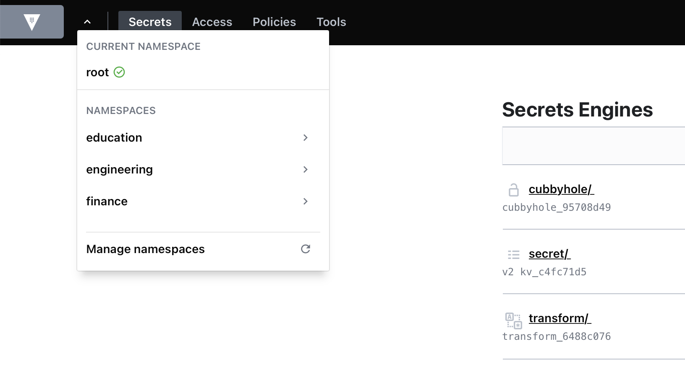

# Vault Hands-On Examples

## Setup

- you need a linux box with docker installed
- clone this repo

```bash
git clone https://github.com/commandemy/vault.git
```

and run the `setup.sh`

```bash
$ ./setup.sh
==============
Terraform v0.15.1
on linux_amd64
==============
Vault v1.7.1+ent (ab111a1fb8973e0ab2e7ae3c03f71fbcd780a5db)
==============
Key             Value
---             -----
Seal Type       shamir
Initialized     true
Sealed          false
Total Shares    1
Threshold       1
Version         1.7.1
Storage Type    inmem
Cluster Name    vault-cluster-6cf20c3c
Cluster ID      c9e2f5de-a645-b9ba-5c3a-c0d72df7ebc2
HA Enabled      false
```

## Using the Vault API

Documentation is here: <https://www.vaultproject.io/api-docs/index>

```bash
$ curl -s --header "X-Vault-Token: ${VAULT_TOKEN}" ${VAULT_ADDR}/v1/sys/license | jq
{
  "request_id": "91407972-a1d8-4dca-07a1-534a974c1beb",
  "lease_id": "",
  "renewable": false,
  "lease_duration": 0,
  "data": {
    "expiration_time": "2021-04-30T13:28:59.143393726Z",
    "features": [
      "HSM",
      "Performance Replication",
      "DR Replication",
      "MFA",
      "Sentinel",
      "Seal Wrapping",
      "Control Groups",
      "Performance Standby",
      "Namespaces",
      "KMIP",
      "Entropy Augmentation",
      "Transform Secrets Engine",
      "Lease Count Quotas",
      "Key Management Secrets Engine",
      "Automated Snapshots"
    ],
    "license_id": "temporary",
    "performance_standby_count": 9999,
    "start_time": "2021-04-30T07:23:59.143393726Z"
  },
  "wrap_info": null,
  "warnings": [
    "time left on license is 5h57m27s"
  ],
  "auth": null
}
```

## Codify Management of Vault

These assets are provided to perform the tasks described in the following tutorials:

- [Codify Management of Vault Enterprise](https://learn.hashicorp.com/tutorials/vault/codify-mgmt-enterprise)

```bash
$ git clone https://github.com/commandemy/vault-guides
$ cd vault-guides/operations/codify-mgmt/enterprise/

$ vault namespace list
No namespaces found
```

So nothing there. You can browse Vault UI on your VSCode Instance.
Use http://vscode-<your-instance-id>.co-pla.training.

Example:

- <http://vscode-02.co-pla.training:8200>
- Token: `myroot`

No we need to run

```bash
$ terraform init
$ terraform plan
$ terraform apply
```

Sample Output:

```bash
$ terraform init

Initializing the backend...

Initializing provider plugins...
- Finding hashicorp/vault versions matching "~> 2.12"...
- Installing hashicorp/vault v2.19.1...
- Installed hashicorp/vault v2.19.1 (signed by HashiCorp)

Terraform has created a lock file .terraform.lock.hcl to record the provider

... snipped ...

commands will detect it and remind you to do so if necessary.
```

```bash
$ terraform plan

Terraform used the selected providers to generate the following execution plan. Resource actions are indicated with the following symbols:
  + create
 <= read (data resources)

Terraform will perform the following actions:

  # data.vault_transform_encode.encoded will be read during apply
  # (config refers to values not yet known)
 <= data "vault_transform_encode" "encoded"  {
      + batch_results = (known after apply)
      + encoded_value = (known after apply)
      + id            = (known after apply)
      + path          = "transform"
      + role_name     = "payments"
      + value         = "1111-2222-3333-4444"
    }

  # vault_auth_backend.userpass will be created
  + resource "vault_auth_backend" "userpass" {
      + accessor                  = (known after apply)
      + default_lease_ttl_seconds = (known after apply)
      + id                        = (known after apply)
      + listing_visibility        = (known after apply)
      + max_lease_ttl_seconds     = (known after apply)
      + path                      = (known after apply)
      + tune                      = (known after apply)
      + type                      = "userpass"
    }

  # vault_transform_transformation.ccn-fpe will be created
  + resource "vault_transform_transformation" "ccn-fpe" {
      + allowed_roles = [
          + "payments",
        ]
      + id            = (known after apply)
      + name          = "ccn-fpe"
      + path          = "transform"
      + template      = "ccn"
      + templates     = (known after apply)
      + tweak_source  = "internal"
      + type          = "fpe"
    }

Plan: 22 to add, 0 to change, 0 to destroy.

Changes to Outputs:
  + encoded = (known after apply)

─────────────────────────────────

Note: You didn't use the -out option to save this plan, so Terraform can't guarantee to take exactly these actions if you run "terraform apply" now.
```

```bash
$ terraform apply
vault_policy.fpe_client_policy: Refreshing state... [id=fpe-client]
vault_auth_backend.userpass: Refreshing state... [id=userpass]
vault_policy.admin_policy: Refreshing state... [id=admins]
vault_generic_endpoint.student: Refreshing state... [id=auth/userpass/users/student]

Terraform used the selected providers to generate the following execution plan. Resource actions are indicated with the following symbols:
  + create
  ~ update in-place
 <= read (data resources)

Terraform will perform the following actions:

  # data.vault_transform_encode.encoded will be read during apply
  # (config refers to values not yet known)
 <= data "vault_transform_encode" "encoded"  {
      + batch_results = (known after apply)
      + encoded_value = (known after apply)
      + id            = (known after apply)
      + path          = "transform"
      + role_name     = "payments"
      + value         = "1111-2222-3333-4444"
    }

vault_policy.admin_policy_boundary: Creation complete after 0s [id=admins]
vault_policy.admin_policy_vault_cloud: Creating...
vault_policy.admin_policy_vault_cloud: Creation complete after 0s [id=admins]

Apply complete! Resources: 20 added, 2 changed, 0 destroyed.

Outputs:

encoded = "8386-0764-7712-9161"

```



## Vault HA Cluster with Integrated Storage (Raft)

These assets are provided to perform the tasks described in the following guides:

- [Vault HA with Raft Storage Backend](https://learn.hashicorp.com/vault/operations/raft-storage) guide uses the script in the [`local`](https://github.com/hashicorp/vault-guides/tree/master/operations/raft-storage/local) sub-folder

```bash
$ git clone https://github.com/commandemy/vault-guides
$ git checkout 
$ cd ~/vault-guides/operations/raft-storage/local
```
